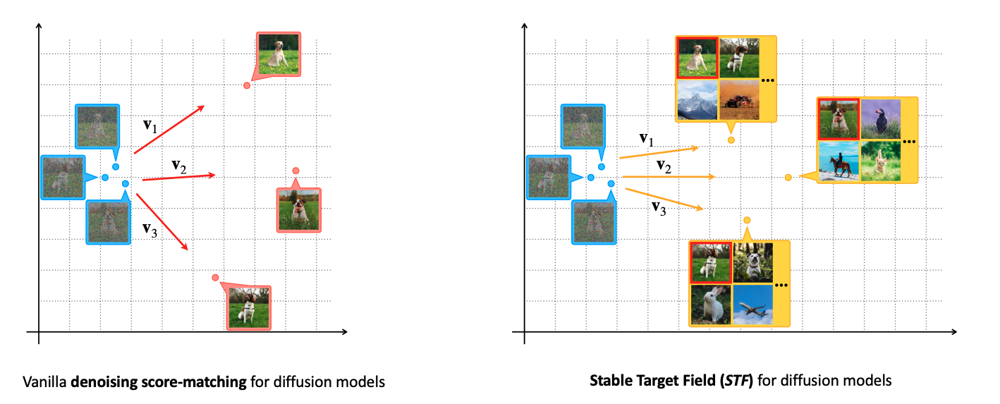

# Stable Target Field for Reduced Variance Score Estimation in Diffusion Models

Pytorch implementation of the ICLR 2023 paper [Stable Target Field for Reduced Variance Score Estimation in Diffusion Models](https://openreview.net/forum?id=WmIwYTd0YTF), 

by [Yilun Xu](http://yilun-xu.com)\*, Shangyuan Tong*, [Tommi S. Jaakkola](http://people.csail.mit.edu/tommi/)


Diffusion models generate samples by reversing a fixed forward diffusion process. Despite already providing impressive empirical results, these diffusion models algorithms can be further improved by reducing the variance of the training targets in their denoising score-matching objective. We argue that the source of such variance lies in the handling of intermediate noise-variance scales, where multiple modes in the data affect the direction of reverse paths. We propose to remedy the problem by incorporating a reference batch which we use to calculate weighted conditional scores as more stable training targets. We show that the procedure indeed helps in the challenging intermediate regime by reducing (the trace of) the covariance of training targets. **The new stable targets can be seen as trading bias for reduced variance, where the bias vanishes with increasing reference batch size.** Empirically, we show that the new objective improves the image qualitymyre, stability, and training speed of various popular diffusion models across datasets with both general ODE and SDE solvers. When used in combination with state-of-the-art diffusion models (EDM (Karras et al., 2022)), our method yields a current **SOTA FID of 1.90** with 35 network evaluations on the unconditional CIFAR-10 generation task.



----


## Outline

Our implementation is heavily rely on the [EDM](https://github.com/NVlabs/edm) repo. We highlight our modifications based on their original command lines for [training](#training-new-models-with-stf), [sampling and evaluation](#generate-&-evaluations). We also provide the instruction for [set-ups](#the-instructions-for-set-ups-from-edm-repo), such as requirements and dataset preparation, from EDM repo.

## Training new models with STF

You can train new models using `train.py`. We provide example command line for CIFAR-10 unconditional generation:

```.bash
torchrun --standalone --nproc_per_node=8 train.py --outdir=training-runs --name exp_name \
--data=datasets/cifar10-32x32.zip --cond=0 --arch=arch --stf=stf

stf: use stable target field or not. options: 0 | 1
exp_name: name of experiments 
arch: model architectures. options: ncsnpp | ddpmpp
```

The above example uses the default batch size of 512 images (controlled by `--batch`) that is divided evenly among 8 GPUs (controlled by `--nproc_per_node`) to yield 64 images per GPU. Training large models may run out of GPU memory; the best way to avoid this is to limit the per-GPU batch size, e.g., `--batch-gpu=32`. This employs gradient accumulation to yield the same results as using full per-GPU batches. See [`python train.py --help`](./docs/train-help.txt) for the full list of options.

The results of each training run are saved to a newly created directory  `training-runs/exp_name` . The training loop exports network snapshots `training-state-*.pt`) at regular intervals (controlled by  `--dump`). The network snapshots can be used to generate images with `generate.py`, and the training states can be used to resume the training later on (`--resume`). Other useful information is recorded in `log.txt` and `stats.jsonl`. To monitor training convergence, we recommend looking at the training loss (`"Loss/loss"` in `stats.jsonl`) as well as periodically evaluating FID for `training-state-*.pt` using `generate.py` and `fid.py`.


**Sidenote:** The original EDM repo provide more dataset: FFHQ, AFHQv2, ImageNet-64. We did not test the performance of *STF* on these datasets due to limited computational resources. However, we believe that the *STF* technique can consistently improve the model across datasets. Please let us know if you have those resutls 😀

## Generate & Evaluations

- Generate 50k samples:

  ```zsh
  torchrun --standalone --nproc_per_node=8 generate.py \
  --seeds=0-49999 --outdir=./training-runs/exp_name 
     
  exp_name: name of experiments
  ```

  Note that the numerical value of FID varies across different random seeds and is highly sensitive to the number of images. By default, `fid.py` will always use 50,000 generated images; providing fewer images will result in an error, whereas providing more will use a random subset. To reduce the effect of random variation, we recommend repeating the calculation multiple times with different seeds, e.g., `--seeds=0-49999`, `--seeds=50000-99999`, and `--seeds=100000-149999`. In the EDM paper, they calculated each FID three times and reported the minimum.

- FID evaluation

  ```zsh
  torchrun --standalone --nproc_per_node=8 fid.py calc --images=training-runs/exp_name --ref=fid-refs/cifar10-32x32.npz --num 50000 
  
  exp_name: name of experiments
  ```

  


## The instructions for set-ups from EDM repo

### Requirements

- Linux and Windows are supported, but we recommend Linux for performance and compatibility reasons.
- 1+ high-end NVIDIA GPU for sampling and 8+ GPUs for training. We have done all testing and development using V100 and A100 GPUs.

- 64-bit Python 3.8 and PyTorch 1.12.0 (or later). See [https://pytorch.org](https://pytorch.org/) for PyTorch install instructions.
- Python libraries: See `environment.yml`for exact library dependencies. You can use the following commands with Miniconda3 to create and activate your Python environment:
  - `conda env create -f environment.yml -n edm`
  - `conda activate edm`
- Docker users:
  - Ensure you have correctly installed the [NVIDIA container runtime](https://docs.docker.com/config/containers/resource_constraints/#gpu).
  - Use the [provided Dockerfile](https://github.com/NVlabs/edm/blob/main/Dockerfile) to build an image with the required library dependencies.

### Preparing datasets

Datasets are stored in the same format as in [StyleGAN](https://github.com/NVlabs/stylegan3): uncompressed ZIP archives containing uncompressed PNG files and a metadata file `dataset.json` for labels. Custom datasets can be created from a folder containing images; see [`python dataset_tool.py --help`](./docs/dataset-tool-help.txt) for more information.

**CIFAR-10:** Download the [CIFAR-10 python version](https://www.cs.toronto.edu/~kriz/cifar.html) and convert to ZIP archive:

```.bash
python dataset_tool.py --source=downloads/cifar10/cifar-10-python.tar.gz \
    --dest=datasets/cifar10-32x32.zip
python fid.py ref --data=datasets/cifar10-32x32.zip --dest=fid-refs/cifar10-32x32.npz
```

**FFHQ:** Download the [Flickr-Faces-HQ dataset](https://github.com/NVlabs/ffhq-dataset) as 1024x1024 images and convert to ZIP archive at 64x64 resolution:

```.bash
python dataset_tool.py --source=downloads/ffhq/images1024x1024 \
    --dest=datasets/ffhq-64x64.zip --resolution=64x64
python fid.py ref --data=datasets/ffhq-64x64.zip --dest=fid-refs/ffhq-64x64.npz
```

**AFHQv2:** Download the updated [Animal Faces-HQ dataset](https://github.com/clovaai/stargan-v2/blob/master/README.md#animal-faces-hq-dataset-afhq) (`afhq-v2-dataset`) and convert to ZIP archive at 64x64 resolution:

```.bash
python dataset_tool.py --source=downloads/afhqv2 \
    --dest=datasets/afhqv2-64x64.zip --resolution=64x64
python fid.py ref --data=datasets/afhqv2-64x64.zip --dest=fid-refs/afhqv2-64x64.npz
```

**ImageNet:** Download the [ImageNet Object Localization Challenge](https://www.kaggle.com/competitions/imagenet-object-localization-challenge/data) and convert to ZIP archive at 64x64 resolution:

```.bash
python dataset_tool.py --source=downloads/imagenet/ILSVRC/Data/CLS-LOC/train \
    --dest=datasets/imagenet-64x64.zip --resolution=64x64 --transform=center-crop
python fid.py ref --data=datasets/imagenet-64x64.zip --dest=fid-refs/imagenet-64x64.npz
```


